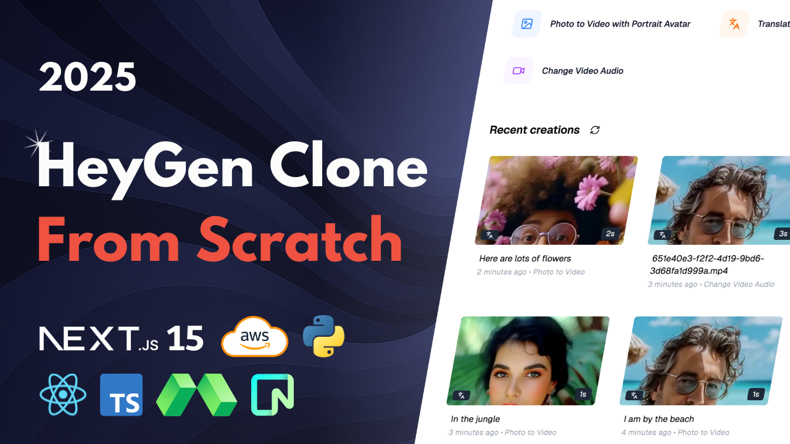

# Hey Gen Clone



[Link to video](https://youtu.be/s4P-H-ptKr0)

[Discord and more](https://www.andreastrolle.com/)

## Overview

Hi 🤙 In this project, you'll build a SaaS application that generates realistic AI videos. The tool uses state-of-the-art models to create talking avatars from a single photo, translate videos into different languages with voice cloning and lip-syncing, and replace the audio on existing videos. You'll learn how to build a complete production-ready SaaS with user authentication, a credit-based payment system, and background processing queues to handle user load. All services used in this project are free, so you won't have to pay anything to follow along. We'll use technologies such as Next.js 15, React, Typescript, Tailwind CSS, ShadCN, BetterAuth, Polar, Python, FastAPI, Modal, Inngest, Neon, S3 on AWS, and more.

Features:

- 🧑‍🦰 AI Portrait Avatars with fudan-generative-ai/hallo3
- 🗣️ AI Voice Cloning & TTS with chatterbox-tts
- 🌐 AI Video Translation to 30+ languages with lip-sync
- 🔄 Change Video Audio with automatic lip-syncing
- ⚡ Serverless GPU Processing with Modal
- 📊 Background Job Queue with Inngest
- 💳 Credit-Based System for video generation
- 💰 Polar.sh Integration for purchasing credit packs
- 👤 User Authentication with BetterAuth
- 🎛️ Dashboard to manage generated videos
- 🐍 Python & FastAPI Backend for AI logic
- 📱 Modern UI with Next.js, Tailwind CSS & Shadcn UI

## Setup

Follow these steps to install and set up the project.

### Clone the Repository

```bash
git clone https://github.com/Andreaswt/hey-gen-clone.git
```

### Install Python

Download and install Python if not already installed. Use the link below for guidance on installation:
[Python Download](https://www.python.org/downloads/)

Create a virtual environment with **Python 3.12**.

### Backend

Navigate to backend folder:

```bash
cd backend
```

Install dependencies:

```bash
pip install -r requirements.txt
```

Modal setup:

```bash
modal setup
```

Run on Modal:

```bash
modal run main.py
```

Deploy Modal services:

```bash
modal deploy backend/photo-to-video/ptv.py
```

```bash
modal deploy backend/file-to-s3/file_to_s3.py
```

```bash
modal deploy backend/text-to-speech/tts.py
```

### Frontend

Install dependencies:

```bash
cd frontend
npm i
```

Run:

```bash
npm run dev
```

### Queue

Run the local queue development server with Inngest:

```bash
cd frontend
npx inngest-cli@latest dev
```

## AWS Setup

Policy for frontend user:

```bash
{
    "Version": "2012-10-17",
    "Statement": [
        {
            "Sid": "VisualEditor0",
            "Effect": "Allow",
            "Action": [
                "s3:PutObject",
                "s3:GetObject"
            ],
            "Resource": "arn:aws:s3:::hey-gen-clone-bucket/*"
        },
        {
            "Sid": "VisualEditor1",
            "Effect": "Allow",
            "Action": "s3:ListBucket",
            "Resource": "arn:aws:s3:::hey-gen-clone-bucket"
        }
    ]
}
```

Policy for backend user:

```bash
{
    "Version": "2012-10-17",
    "Statement": [
        {
            "Sid": "VisualEditor0",
            "Effect": "Allow",
            "Action": "s3:GetObject",
            "Resource": "arn:aws:s3:::hey-gen-clone-bucket/*"
        },
        {
            "Sid": "VisualEditor1",
            "Effect": "Allow",
            "Action": "s3:ListBucket",
            "Resource": "arn:aws:s3:::hey-gen-clone-bucket"
        }
    ]
}
```
